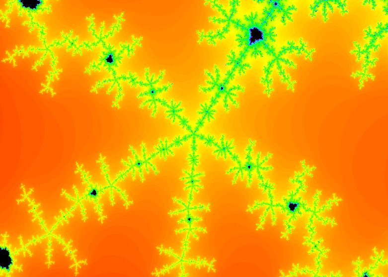

This project I made to practice Java stuff, since I'm studying.

I decided to create the [Mandelbrot set](https://en.wikipedia.org/wiki/Mandelbrot_set) because I found it interesting.

I don't think it's the best way to do this (I could use GPU processing for example), but for a small project, I think it's fine.

## Controls
`Left Click` to move the camera.
`Right Click` to zoom in.

